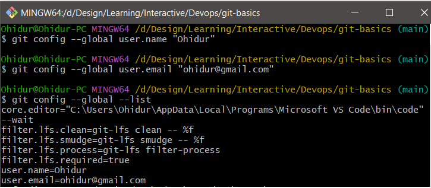
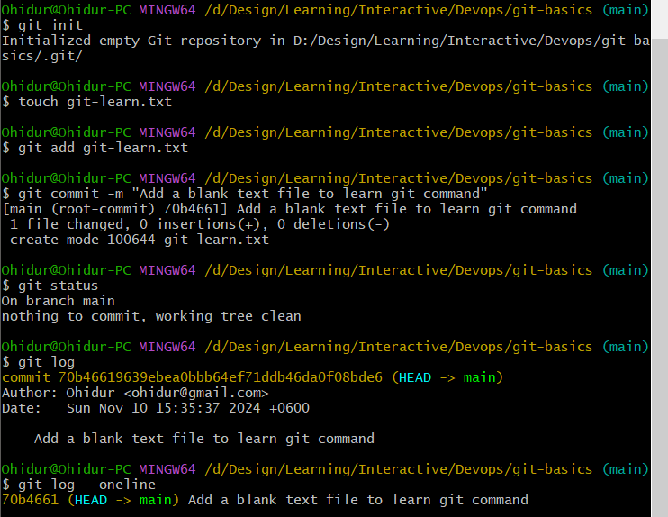
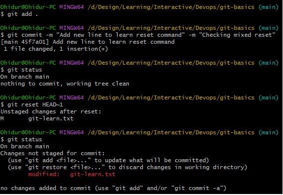
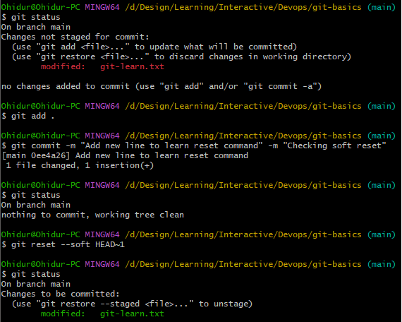
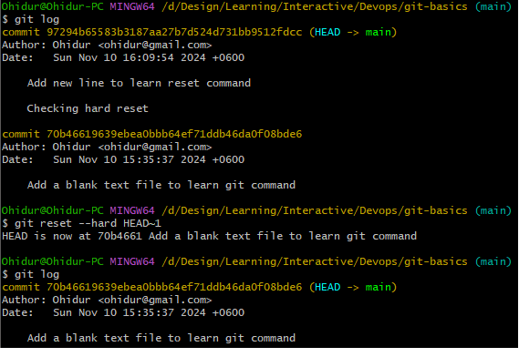
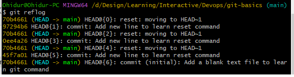

# Assignment-01 on GIT
## Configuration

**git config --global --get user.email**
- Set user email

**git config --global --get user.name**
- Set user name

## SSH
**ssh-keygen -t rsa -b 4096 -C "ohidur@gmail.com"**
- Generate SSH Key
- It will create 2 file
-- Private : id_rsa
-- Public : id_rsa.pub
- OS Windows: These files will found the following location:  **users > [user name] > .ssh > id_rsa.. here**

**Add SSH in github**
- copy public key from **id_rsa.pub**
- Login to github account
- go to settings > Add SSH > Authentication > **paste** public key > Create

**ssh -T git@github.com**
- Test SSH connection ok or not

## Basic Commands

**git init**
- Initialize git repository

**git add .**
**git add [file name]**
- Add file untracked to stage level for commit

**git commit -m "commit message" -m "commit description"**
- Commit staged changes
- Commit message should be follow rules, like present tense, proper case
- Commit description should be informtive

**git commit --amend**
- Amendment the commit message

**git status**
- Check current repository changes status

**git log**
- Check commit history
- It returns
-- Commit - SHA - (HEAD->branch name)
-- Author
-- Date
-- Commit Message & Descriptions

**git log --oneline**
- Show all commit history with one line message

## Undo Commit

**git reset HEAD~n**
**git reset --mixed HEAD~n**
- Example: git reset HEAD~1
- Undo lastest commit (last one)
- File commit status change to unstage level, **color: read**
- File content will stay same
- It is default command

**git reset --soft HEAD~n**
- Example: git reset --soft HEAD~1
- Undo lastest commit (last one)
- File commit status change to stage level, **color: green**
- File content will stay same

**git reset --hard HEAD~n**
- Example: git reset --soft HEAD~1
- Undo lastest commit (last one)
- File content & commit both will remove.

## Work with remote repository
**git clone [remote url]**
- Example:
- - git clone https://github.com/Ohidur/ic-devops-batch3.git (**With HTTPS**)
- - git clone git@github.com/Ohidur/ic-devops-batch3.git  (**with SSH**)
- Clone a remote repository
- Working steps
- - First copy a remote repository url
- - Run above command
- - I will get a local copy of remote repository
- It will create a remote name, called **origin**

**git remote add [remote name] [remote_url]**
- Example: git remote add ohidur https://github.com/Ohidur/ic-devops-batch3.git
- Set a name for remote repository, example **ohidur**
- We may create as many as we want

**git remote -v**
- Show remote's list
- origin  https://github.com/Ohidur/candy-bucket.git (fetch)
- origin  https://github.com/Ohidur/candy-bucket.git (push)
- ohidur  https://github.com/Ohidur/candy-bucket.git (fetch)
- ohidur  https://github.com/Ohidur/candy-bucket.git (push)

**git remote remove [remote name]/[branch name]**
- Delete remote's name

**git pull origin**
**git pull origin [branch name]**
- Example: git pull ohidur featureLearn
- Update local repository with remote's update

**git fetch origin [branch name]**
- Example: git fetch ohidur featureLearn
- Collect remote repository available to local but not updated

**git rebase origin/main**
- Apply fetched data to local repository

**git push origin [branch name]**
- Example : git push ohidur main
- Update remote repository from local repository

## Work with branches
Our default working branch is main, once it was maste. We will work on feature based branch

**git branch [branch name]**
- Create a new branch with name [branch name]
- Example: git branch git-assignment-1

**git checkout [branch name]**
- Checkout you branch
- Example: git checkout git-assignment-1

**git checkout -b [branch name]**
- Create & checkout a new branch with name [branch name]
- Example: git checkout -b git-assignment-1

**git checkout main**
- checking out my main branch

**git branch**
- Show all local branches

**git branch -a**
- Show all branches - local & remote

**git branch -d [branch name]**
- Example: git delete -d ohidur
- Delete a brach

## Merge
**git merge [branch name]**
- Merge feature branch with main
- Working Steps:
- - Suppose I'm working on Ohidur branch
  - Checkout main branch, using **git checkout main**
  - Now merge ohidur branch with main branch, using **git merge ohidur**
  - Though, we will use **rebase command** instead of **merge command**

## Interactive Rebase
**git rebase -i HEAD~n**
Example: git rebase -i HEAD~3  : go to 3rd commit from top

**Scenario**
- I’ve 100 commit, I need to change from HEAD~
- Git rebase --continue		-if no issue, multiple commit will pass at a time
- Git rebase -i HEAD~3		- open file with last 3 commits for flag - edit/pick/…
-- I changed flag to edit at “1st commit”, close file
-- open main file at “1st commit”

**With Conflict**
- Change 1st file & close	 : file status is unstage , color: red
- Git add .
- Git commit --amend 	     : to change the commit message
- Close commit file
-- Git rebase --continue	 : now file will show conflict, current change,

- 2nd commit file shown as incoming change
-- Git add .			          : changes added, green,
-- Git rebase --continue		: system will open 2nd commit window
- I don't want to change 2nd commit message
-- Close commit file		    : file conflict show again, solve conflict
-- Git add .
-- Git rebase --continue		  : system will open 3rd commit window

**Without Conflict** (I want to add new file name 2ndFile at 1st commit level)
- Add 2nd file 			        : file status is unstage , color: red
- Git add .
- Git commit --amend 		    : to change the commit message
- Close commit file
- Git rebase --continue

##Cherry Pick
**git cherry-pick [commit hash]**
- Applies a specific commit from another branch

## Fork
- What is fork
-- It's like a copy that is actively connected with the source and gets updates from the source.
-- Best way to copy any repo with connect the source.
-- I’ll work on my own fork
-- If want to submit my task to source then do with Pull Request

- Advantages of forking
-- I need a repo
-- I want to update myself
-- I don’t want to see my update by other users
-- But want to get updates from the source repository by others

**Fork a repository**
- Open source repository
- Click on fork
- Create fork
- Now, I'll get a repository copy in my remote

**git clone [repository url]**
- Getting my remote forked repository to my local computer
- This command will set remote name as origin by default
- I may connect source repository with any name using **git remote add [name] [source url]**

## Reflog
**git reflog**
- Show all history of a repository which is helpful for recovery

